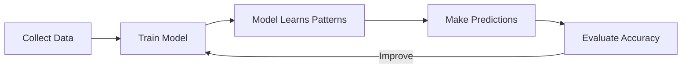

# What is Machine Learning?

---

## 🎯 Purpose

Machine Learning (ML) is a branch of Artificial Intelligence that enables computers to learn patterns from data instead of being explicitly programmed with rules.

Instead of writing:

"If temperature > 40°C, then fan ON"

We allow the computer to observe many examples and discover the relationship itself.

Machine Learning is used when writing rules manually becomes impossible because the data is too complex.

---

## ⚙️ Architecture



---

## <i class="fas fa-wrench"></i> Workflow

```bash
Collect Data
      ↓
Prepare Dataset
      ↓
Choose ML Model
      ↓
Train Model
      ↓
Calculate Error
      ↓
Improve Model
      ↓
Deploy
      ↓
Predict New Data
```

---

## 🧩 Key Components

### 📊 Data

-  Examples the model learns from.

   - example:  `Age, Salary → Buy Product?`

---

### 🧠 Model

- A mathematical function that learns patterns from data.

  - Example:

    - Linear Regression

    - Decision Tree

    - Neural Network

---

### 📉 Loss Function

- Measures how wrong the prediction is.

- Lower Loss = Better Model

---

### ⚙ Optimizer

- Changes the model parameters to reduce the loss.

- Most common:

  - Gradient Descent

  - Adam

---

### 🎯 Prediction

- The final output generated by the trained model.

  - Examples:

      - Spam / Not Spam
      
      - Dog / Cat
      
      - House Price
      
      - Customer Churn
      
---

## 💻 Example Code

```python
from sklearn.linear_model import LinearRegression

X = [[2], [4], [6], [8]]
y = [40, 50, 65, 80]

model = LinearRegression()
model.fit(X, y)

prediction = model.predict([[5]])

print(prediction)
```

Output

```number
57.5
```

The model learned the relationship between study hours and exam score.

---

## ⚠ Common Mistakes

❌ Thinking AI and ML are the same thing.

* AI is the broader field.

* ML is one way to build AI.

❌ Using poor-quality data.

* Bad data always produces poor models.

❌ Expecting the model to memorize everything.

* A good model should generalize to unseen data.

❌ Training with too little data.

* The model cannot discover useful patterns.

❌ Ignoring evaluation metrics.

* Always measure performance before deployment.

---

## 🚀 Used In

* Recommendation Systems (Netflix, Amazon)
* Face Recognition
* Self Driving Cars
* Fraud Detection
* Medical Diagnosis
* Chatbots
* Image Recognition
* Speech Recognition

---

## 📝 Interview Questions

### 1. What is Machine Learning?

* Machine Learning is the process of enabling computers to learn patterns from data without being explicitly programmed.

### 2. What is the difference between AI and ML?

* AI is the broader field.
* Machine Learning is a subset of AI.
  
### 3. What are the four basic parts of Machine Learning?

* Data
* Model
* Loss Function
* Optimizer

### 4. Why is data important?

* Because the model learns only from the examples provided.

### 5. What happens during training?

* The model repeatedly predicts, calculates error, updates itself, and improves.

---

## ⚡ 30-Second Revision

✅ ML learns from data

✅ Data is the fuel

✅ Model finds patterns

✅ Loss measures mistakes

✅ Optimizer reduces mistakes

✅ Better data = Better model

✅ Training is repeated improvement

---

## 📚 References

* <https://scikit-learn.org/>
* <https://developers.google.com/machine-learning>
* <https://www.deeplearningbook.org/>
* <https://course.fast.ai/>
* <https://www.kaggle.com/learn>
