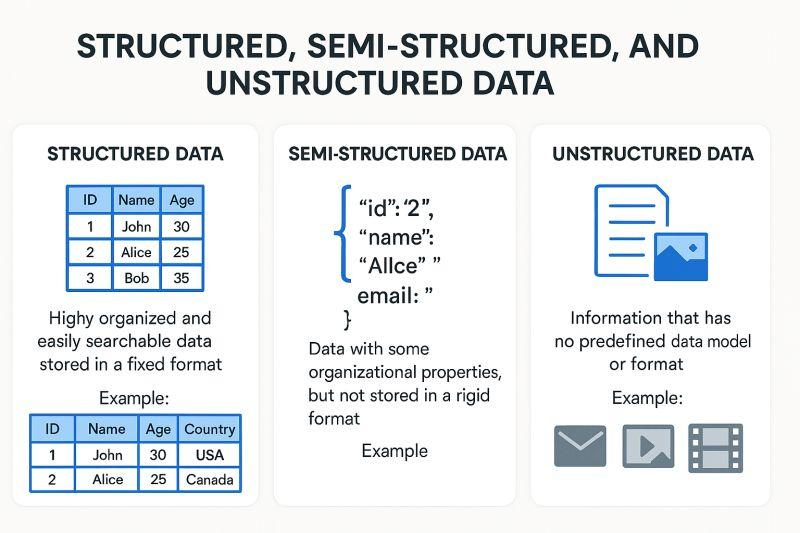
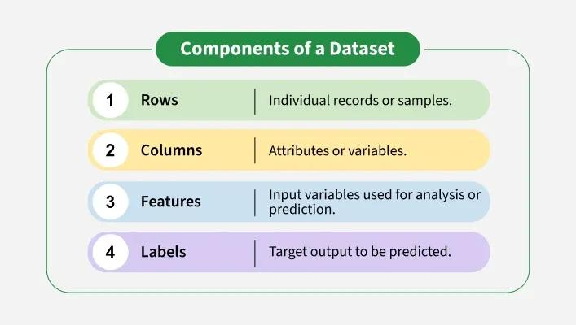
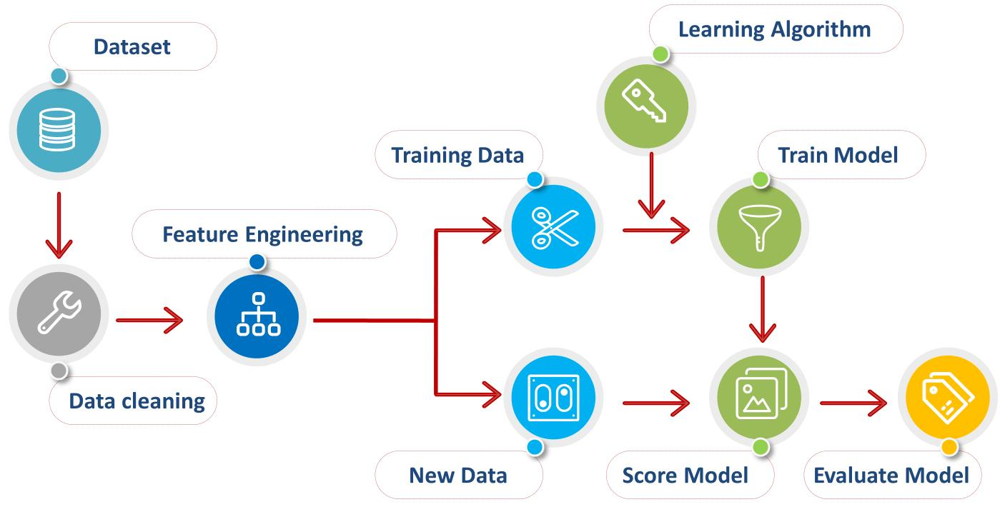
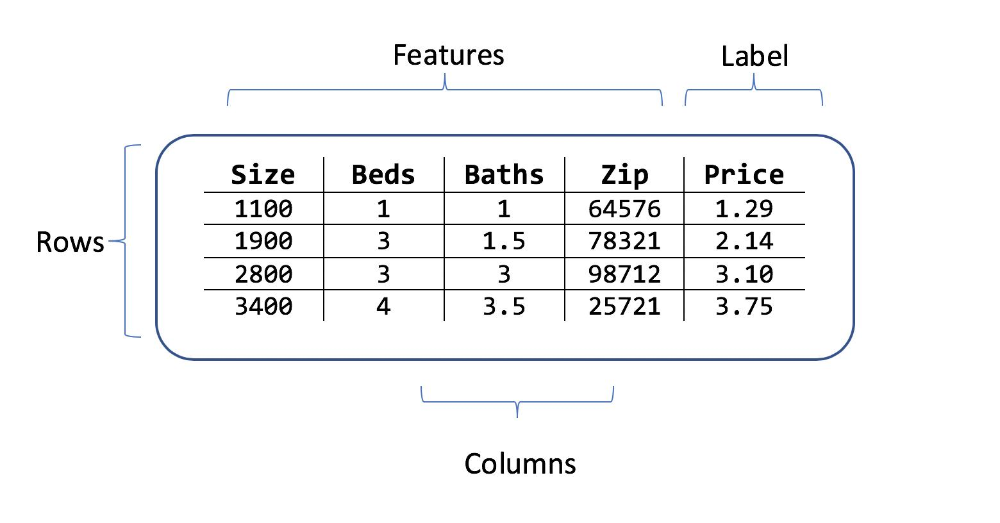

# 📌 Topic

# Data

---

## 🎯 Purpose

Data is the foundation of every Machine Learning model.

A machine cannot learn anything without examples.

The quality, quantity, and diversity of the data directly affect how well the model performs.

> **Rule:** Better Data → Better Model

---

## 💡 Intuition

Imagine you're teaching a child to identify cats.

You don't explain every rule like:

- Cats have whiskers.
- Cats have pointy ears.
- Cats have tails.

Instead, you simply show hundreds of cat pictures.

Eventually, the child starts recognizing cats naturally.

Machine Learning works the same way.

The examples you show the model are called **Data**.

---

## ⚙️ Architecture


---

## 🔍 Types of Data

### Structured Data

- Organized in rows and columns.
- Stored inside databases or spreadsheets.

Example

| Name  | Age | Salary |
| ----- | --- | ------ |
| John  | 25  | 40000  |
| Alice | 30  | 70000  |

Examples

- SQL Database
- Excel
- CSV Files

---

### Unstructured Data

No predefined format.

Examples

- Images
- Videos
- Audio
- Emails
- PDF Documents
- Social Media Posts

---

### Semi-Structured Data

Partially organized.

Examples

- JSON
- XML
- HTML

Example

```json
{
  "name": "John",
  "age": 25,
  "salary": 40000
}
```


---

## ⚙ Workflow

```bash
Collect Raw Data
        ↓
Clean Data
        ↓
Handle Missing Values
        ↓
Remove Duplicate Data
        ↓
Convert into Dataset
        ↓
Split Dataset
        ↓
Train Model
```

---

## 🧩 Key Components

### 📦 Dataset

The complete collection of data.

Example

```
10,000 customer records
```


---

### 📈 Features (Input)

The information given to the model.

Example

```
Age
Salary
Height
Weight
Experience
```

Also called

- Inputs
- Variables
- X

---

### 🎯 Label (Output)

The value we want to predict.

Example

```
House Price
Spam
Customer Churn
Disease
```

Also called

- Target
- Output
- Y

---

### 📄 Sample

One single row of the dataset.

Example

| Age | Salary | Buy Laptop |
| --- | ------ | ---------- |
| 25  | 40000  | Yes        |

This is **one sample**.

---

### 📊 Feature Matrix (X)

All input values together.

Example

```
Age    Salary
25     40000
30     60000
35     90000
```

---

### 🎯 Target Vector (Y)

The expected output.

Example

```
Yes
No
Yes
```

---

## 📚 Dataset Example

Predict whether someone buys a laptop.

| Age | Salary | Experience | Bought Laptop |
| --- | ------ | ---------- | ------------- |
| 22  | 25000  | 1          | No            |
| 28  | 45000  | 4          | Yes           |
| 35  | 90000  | 10         | Yes           |
| 19  | 18000  | 0          | No            |

Features

```
Age
Salary
Experience
```

Label

```
Bought Laptop
```


---

## 💻 Example Code

```python
import pandas as pd

data = {
    "Age":[22,28,35],
    "Salary":[25000,45000,90000],
    "Bought":[0,1,1]
}

df = pd.DataFrame(data)

print(df)
```

Output

```
   Age  Salary  Bought
0   22   25000      0
1   28   45000      1
2   35   90000      1
```

---

## 📌 Bullet Breakdown

### What is Data?

- Collection of examples.
- Used to teach the machine.
- Can be numbers, text, images, videos, or audio.

---

### What are Features?

- Inputs given to the model.
- Describe each sample.
- Usually represented as **X**.

Example

```
Age
Salary
Height
```

---

### What is a Label?

- The correct answer.
- What we want the model to predict.
- Usually represented as **Y**.

Example

```
House Price
Spam
Disease
```

---

### What is a Dataset?

- Collection of many samples.
- Contains Features + Labels.

---

### Why is Data Important?

- Model learns only from data.
- Poor data produces poor predictions.
- More relevant data usually improves performance.

---

## ⚠ Common Mistakes

❌ Confusing Features with Labels.

Features are Inputs.

Labels are Outputs.

---

❌ Using too little data.

The model cannot discover useful patterns.

---

❌ Ignoring missing values.

Missing data can reduce model performance.

---

❌ Using duplicate records.

Duplicates can bias the model.

---

❌ Assuming more data is always better.

Quality is more important than quantity.

---

## 🚀 Used In

- Recommendation Systems
- Fraud Detection
- Face Recognition
- Medical Diagnosis
- Chatbots
- Self Driving Cars
- OCR Systems
- Sales Prediction

---

## 📝 Interview Questions

### 1. What is Data in Machine Learning?

Data is a collection of examples used to train a machine learning model.

---

### 2. What is a Feature?

A feature is an input variable used by the model to make predictions.

---

### 3. What is a Label?

The expected output that the model tries to predict.

---

### 4. What is the difference between Features and Labels?

Features are inputs (X).

Labels are outputs (Y).

---

### 5. Why is high-quality data important?

Because the model can only learn from the examples provided.

Better data usually leads to better predictions.

---

## ⚡ 30-Second Revision

✅ Data teaches the model.

✅ Features = Inputs (X)

✅ Labels = Outputs (Y)

✅ Dataset = Collection of samples

✅ Sample = One row

✅ Better Data = Better Model

---

## 📌 Remember

> **A Machine Learning model is only as good as the data it learns from.**

---

## 📚 References

### Official

- https://scikit-learn.org/stable/user_guide.html
- https://developers.google.com/machine-learning

### Learn

- https://www.kaggle.com/learn
- https://course.fast.ai
