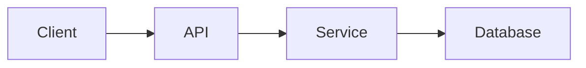

# 🚀 Engineering Knowledge Base

Welcome to my personal **Engineering Knowledge Base**.

This repository contains all of my learning, research, experiments, debugging notes, and technical documentation across different technologies.

The goal of this repository is **not** to copy documentation, but to build a searchable **Second Brain** that helps me quickly revise concepts, understand systems, and solve real-world engineering problems.

---

## 🎯 Goals

* 📚 Document everything I learn.
* 🧠 Improve long-term memory through structured notes.
* 🔍 Quickly search and revise any topic.
* 💼 Build a public engineering portfolio.
* 🚀 Record real project experience, not just theory.

---

## 📂 Repository Structure

```text
Engineering-Notes/

├── Programming/
├── Backend/
├── Frontend/
├── Cloud/
├── AI/
├── IoT/
├── CAD/
├── DevOps/
├── Databases/
├── System Design/
├── Algorithms/
├── Errors/
├── CheatSheets/
├── Assets/
└── README.md
```

---

## 📝 Note Writing Rules

Every note in this repository follows the same structure.

The objective is to make every topic easy to understand, easy to revise, and easy to expand in the future.

---

## 📌 Standard Note Template

### 📌 Topic

Write the name of the concept.

Example:

```
JWT Authentication
```

---

### 🎯 Purpose

Answer one question:

> **Why does this exist?**

Example:

```
Provides stateless authentication between client and server.
```

---

### 🏗 Architecture

Draw the overall system.

Prefer Mermaid diagrams whenever possible.

Example:



---

### ⚙ Workflow

Explain the execution flow step by step.

Example:

```text
User

↓

Login

↓

Server

↓

JWT Generated

↓

Client Stores Token

↓

Authorization Header

↓

Protected API
```

---

### 🧩 Key Components

List only the important building blocks.

Example:

* Header
* Payload
* Signature
* Secret Key

---

### 💻 Example Code

Keep code short.

Prefer **10–20 lines** demonstrating the core idea instead of full implementations.

---

### ⚠ Common Mistakes

Document mistakes that actually happen.

Example:

* Wrong Secret Key
* Expired Token
* Missing Authorization Header
* Invalid Payload

---

### 🚀 Used In

Mention where this concept is used.

Example:

* TAC Smile Studio
* EcoBin
* CAD Editor
* AWS Lambda APIs

---

### 📝 Interview Questions

Write **3–5 common questions**.

Example:

* What is JWT?
* Why is JWT stateless?
* JWT vs Session?
* Can JWT be revoked?
* Where should JWT be stored?

---

### ⚡ 30-Second Revision

Summarize the topic in **5–10 bullets**.

This section should allow revision within 30 seconds.

Example:

* Stateless authentication
* Three parts
* Signed using secret key
* Stored on client
* Sent in Authorization header

---

## 📐 Writing Guidelines

### ✅ Keep Notes Small

One concept = One file.

Avoid putting multiple unrelated topics into a single document.

---

### ✅ Prefer Diagrams

A diagram is usually better than a paragraph.

Use:

* Mermaid
* Flowcharts
* Sequence diagrams
* Class diagrams
* Mind maps

---

### ✅ Prefer Examples

Don't only explain.

Show.

Every note should include at least one example.

---

### ✅ Record Real Problems

Whenever you solve a bug, document it.

Use this format:

```text
Problem

↓

Error

↓

Root Cause

↓

Solution

↓

Prevention
```

These notes become extremely valuable over time.

---

### ✅ Use Bullet Points

Avoid long paragraphs whenever possible.

Good:

* Easy to revise
* Easy to scan
* Easier to remember

---

### ✅ Keep Code Minimal

Don't paste entire projects.

Only include the part that explains the concept.

---

### ✅ Link Related Notes

Whenever possible, connect notes together.

Example:

```
Authentication

↳ JWT

↳ OAuth

↳ Cookies

↳ Sessions
```

---

## 📖 Universal Note Template

Copy this template whenever creating a new note.

````markdown
## 📌 Topic

### 🎯 Purpose

Why does this exist?

---

### 🏗 Architecture

```mermaid
graph LR
```

---

### ⚙ Workflow

```text
Step 1

↓

Step 2

↓

Step 3
```

---

### 🧩 Key Components

- Component 1
- Component 2
- Component 3

---

### 💻 Example Code

```ts

```

---

### ⚠ Common Mistakes

- Mistake 1
- Mistake 2
- Mistake 3

---

### 🚀 Used In

- Project 1
- Project 2

---

### 📝 Interview Questions

1. Question
2. Question
3. Question

---

### ⚡ 30-Second Revision

- Point 1
- Point 2
- Point 3
- Point 4
- Point 5

---

### 📚 References

- Official Documentation
- Blog
- Research Paper
````

---

## 📌 Naming Convention

Use descriptive file names.

✅ Good

```
jwt-authentication.md
aws-lambda.md
react-hooks.md
mqtt-protocol.md
binary-search.md
```

❌ Avoid

```
notes.md
chapter1.md
random.md
new.md
```

---

## 🎨 Style Guide

* Use Markdown only.
* Use Mermaid for architecture.
* Prefer tables over long explanations.
* Use bullet points.
* Add emojis only for section headers.
* Keep code examples concise.
* Keep notes focused on one topic.

---

## 🚀 Repository Philosophy

> **Don't write everything you learn. Write everything you'll forget.**

The purpose of this repository is to build a long-term engineering knowledge base that is easy to search, easy to maintain, and useful for future projects, interviews, and continuous learning.
